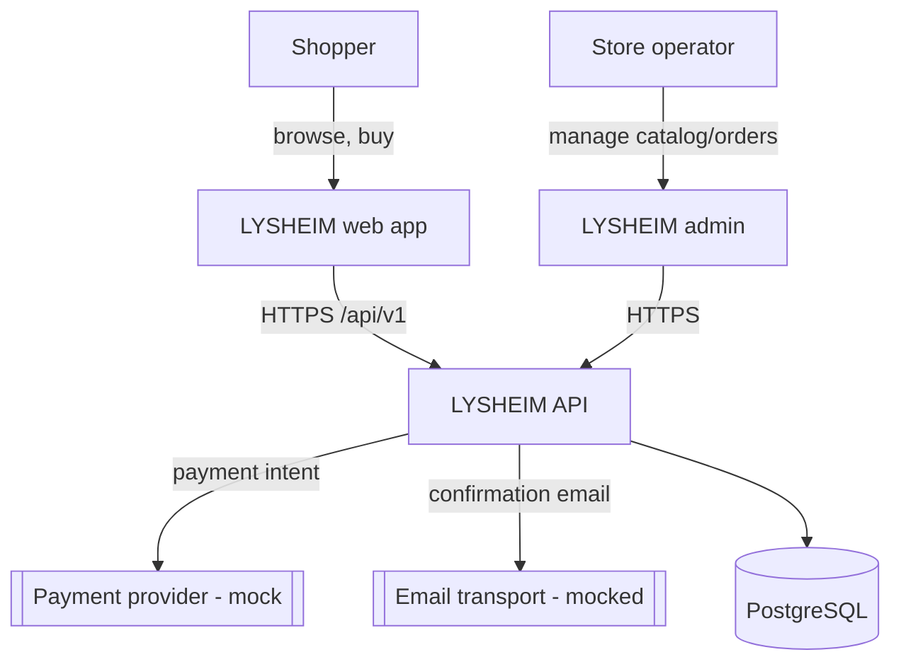
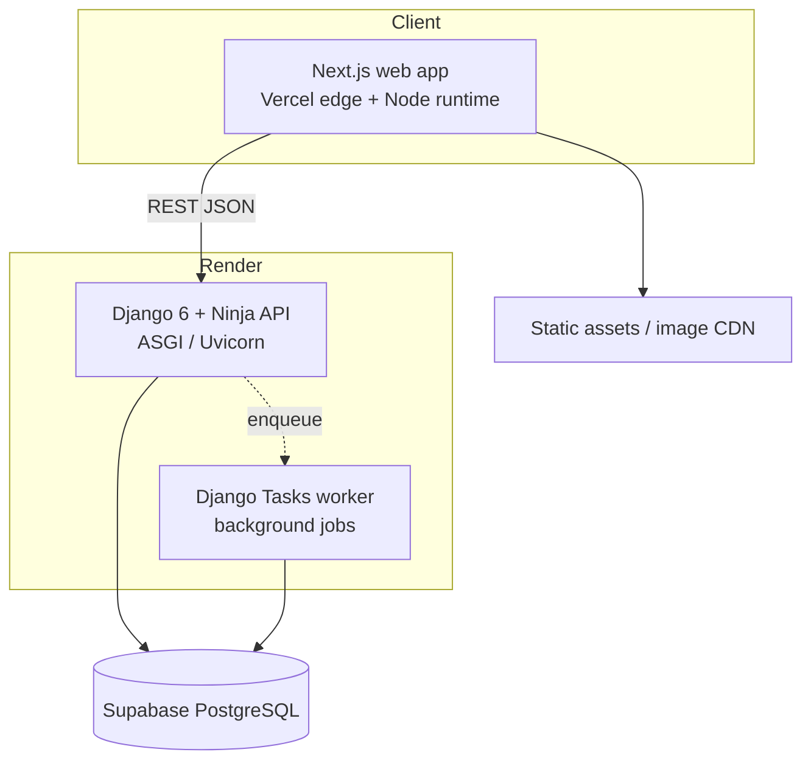
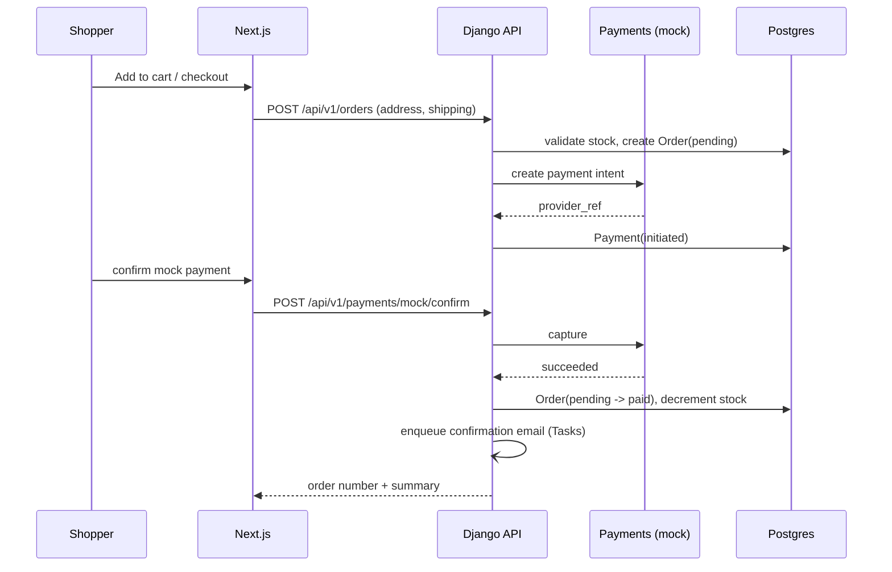

# Architecture — LYSHEIM

> Consulted hats: **Senior System Architect** (lead), **Senior Backend**, **Senior
> Frontend**, **Senior Data Engineer**, **Senior Cloud Engineer**. Owner: Founder.
> Inputs: [`../PLAN.md`](../PLAN.md), [`../01-business/STRATEGY.md`](../01-business/STRATEGY.md),
> [`../02-product/SCOPE.md`](../02-product/SCOPE.md), [`../02-product/UX.md`](../02-product/UX.md).

---

## 1. Context & constraints

LYSHEIM is a decoupled two-application system (Next.js web app + Django API) delivered by a
solo founder on free-tier infrastructure. The architecture must be **finishable**, **honest**
(no microservice cosplay), and **demonstrative** of senior practice: typed, tested,
observable, secure, and documented.

### Architecture principles

1. **Boring, proven technology.** Prefer well-understood defaults over novelty.
2. **Modular monolith, not microservices.** One deployable API with clear module boundaries.
3. **API-first.** The browser talks only to the API; the admin console is the one server-rendered exception.
4. **Configuration over code.** Every external connection is an environment variable.
5. **Observable from day one.** Structured logs and request ids are not a retrofit.
6. **Security and accessibility are design inputs.** See §7.

## 2. System context (C4 level 1)

## 3. Container view (C4 level 2)

| Container | Responsibility | Technology | Hosted on |
|---|---|---|---|
| Web app | Storefront + account + checkout UI | Next.js (App Router, RSC, TypeScript) | Vercel |
| API | Domain logic, auth, REST endpoints | Django 6 + Django Ninja (ASGI) | Render |
| Worker | Off-request jobs (emails, Phase 2 events) | Django 6 Tasks framework | Render |
| Database | System of record | PostgreSQL | Supabase |
| Admin | Operator console for catalog/stock/orders | Django admin (server-rendered) | Render |
| Static assets | Curated product images | Next.js static / object storage | Vercel |

## 4. Domain & bounded contexts (DDD-lite)

| Context | Owns | Depends on |
|---|---|---|
| **Identity & Access** | `User`, `Address`, authentication, tokens | — |
| **Catalog** | `Category`, `Product`, `ProductVariant`, `ProductImage`, `ImageCredit` | — |
| **Cart** | `Cart`, `CartItem` | Catalog, Identity |
| **Ordering** | `Order`, `OrderItem`, `OrderEvent` | Cart, Catalog, Identity |
| **Payments** | `Payment`, mock gateway adapter | Ordering |
| **Operations** | Admin surfaces over Catalog + Ordering | Catalog, Ordering |

**Context map.** Catalog is upstream of Cart and Ordering (Ordering stores *snapshots* of
product name/price so history never changes when a product is edited). Identity is upstream
of everything. Payments is downstream of Ordering and is abstracted behind a gateway
interface so a real provider can replace the mock later. Contexts are Django apps with
explicit public interfaces (services), not shared tables.

**Ubiquitous language.** *product* (sellable concept) vs *variant* (concrete SKU with price
and stock); *cart* (pre-purchase intent) vs *order* (immutable record of a purchase);
*payment* (a money movement attempt, mock in v1).

## 5. Component view (C4 level 3)

**Backend — Django apps**

- `core` — settings, health endpoint, JSON logging, request-id middleware, error envelope, base model, throttling.
- `accounts` — custom `User`, `Address`, JWT issuing/refresh, auth endpoints.
- `catalog` — categories, products, variants, images, credits, public read API.
- `cart` — cart and items, guest merge.
- `orders` — checkout, order creation, status transitions, history.
- `payments` — `Payment`, gateway abstraction, mock provider.

**Frontend — Next.js**

- `app/` route groups: `(shop)` (home, catalog, PDP), `(auth)` (login/register),
  `account`, `cart`, `checkout`, `orders`, `pages/*`. Server Components by default.
- `components/` — the 30-component inventory from `UX.md` §6 (primitives + product components).
- `lib/` — typed API client (generated from OpenAPI), auth/session helpers, money and date formatting.

## 6. Integration & data flow

## 7. Non-functional architecture

- **Performance.** Catalog and PDP are server-rendered (RSC) with HTTP caching and an API
  cache for catalog reads; images are optimized and served from the edge. Budgets in
  `SCOPE.md` NFR-1.
- **Security.** JWT access + refresh (see `ADR-0009`), auth throttling, CSP (Django 6
  built-in), OWASP-minded input validation, and secrets only in the environment. Detailed in
  the Stage 5 security review.
- **Observability.** Structured JSON logs with a correlation id propagated from the web app to
  the API; `/healthz` for uptime checks.
- **Reliability.** Order creation is idempotent by idempotency key to survive double
  submits; database backups via Supabase with a documented restore path.
- **Money.** All amounts are stored as **integer minor units (cents)**, never floats.

## 8. Deployment topology

| Environment | Web | API | DB |
|---|---|---|---|
| Local | `next dev` (or compose) | `uvicorn` (or compose) | Postgres (compose) |
| CI | build + typecheck | `ruff` + `basedpyright` + `pytest` | ephemeral Postgres service |
| Production | Vercel | Render | Supabase |

All environment differences are **variables**, not code (`PLAN.md` §4, `WORKING-AGREEMENT.md`
§1.8). See `ADR-0011` for free-tier constraints and the cold-start mitigation.

## 9. Phase 2 — data platform (outline only)

The store becomes the *source* of a data-engineering project once it is operating. A
sketch (final design and its ADRs are produced when Phase 2 starts):

- **Sources:** storefront/API events (page view, product view, add-to-cart, checkout
  started, order placed) plus transactional tables.
- **Ingestion:** events written to an append-only table and/or a queue (Upstash), drained by
  a worker.
- **Storage:** an `analytics` schema (star-shaped: fact_event, dim_product, dim_date).
- **Transformation:** SQL models (dbt-style) for a conversion funnel, abandonment, AOV, and
  cohorts.
- **Serving:** a dashboard (metabase-style or a small Next view).
- **Governance:** PII minimization (no raw emails in events), retention policy, lineage docs.

> Deliberately out of scope for v1 (`SCOPE.md` `EPIC-7`). Designing it here would be
> premature.

## 10. Cross-cutting concerns

- **Config/secrets:** `.env` locally (via `django-environ`), platform dashboards in the
  cloud; `.env.example` documents every key. Never committed.
- **Errors:** a single error envelope with a machine `code`, a human `message`, and the
  `request_id` (`API.md` §3).
- **Logging:** JSON lines; correlation id in every record.
- **Async:** ASGI serving, `async def` for I/O-bound handlers, the built-in Tasks framework
  for background work (`ADR-0006`).

## 11. Architecture decision index

- `ADR-0005` API style & contract (REST + Ninja + OpenAPI)
- `ADR-0006` Async & background tasks (Django 6)
- `ADR-0007` Operator console (Django admin for v1)
- `ADR-0008` Cart model & guest merge
- `ADR-0009` Authentication & token storage
- `ADR-0010` Mock-first payments
- `ADR-0011` Deployment stack & free-tier constraints
- `ADR-0012` Image licensing & attribution policy
- `ADR-0013` Tailwind CSS for frontend styling
