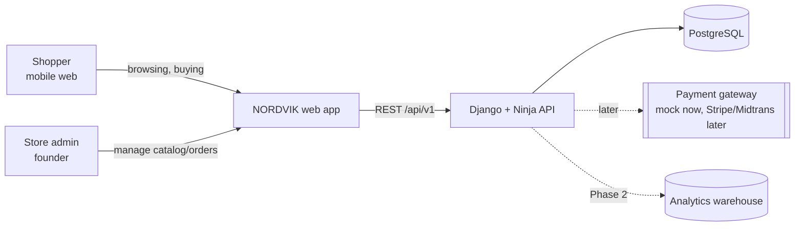
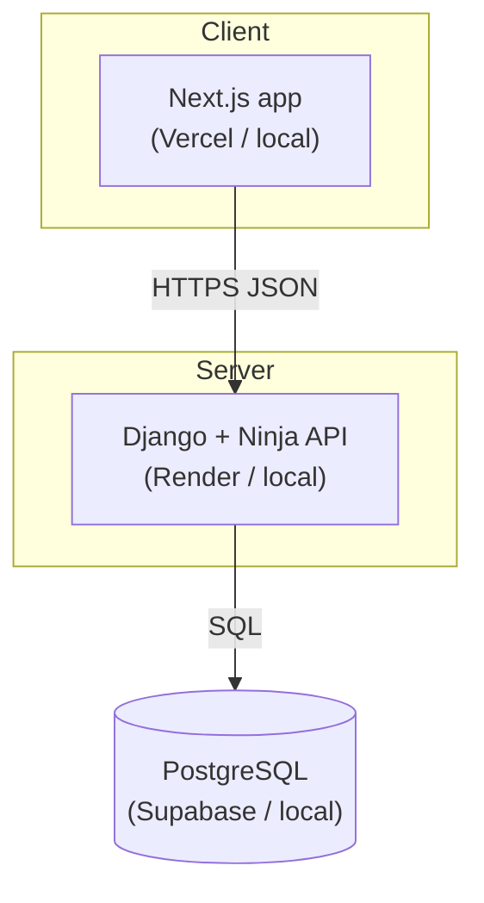

# System Architecture — NORDVIK

> Consulted hats: **System Architect** (lead), **Backend**, **Frontend**, **Cloud Engineer**, **Cybersecurity**. Owner: Founder.

---

## 1. Context & constraints

- **System type:** decoupled e-commerce web application (API + web client).
- **Quality priorities:** changeability > scalability. This is a portfolio project, so the architecture optimizes for *clarity, correctness, and changeability*, not for hypothetical scale.
- **Constraints:** solo developer; free-tier hosting; must run locally with one command; must be genuinely deployable.
- **Explicit scale assumption:** hundreds of products, low thousands of users, single region. **This does not justify microservices.** We choose a **modular monolith**.

- [ ] **SYS-PLAN-1.1 [Style]**
  - **Style:** **Modular monolith** — one Django deployment, internally split into bounded-context apps with explicit boundaries.
  - **Justification:** matching a distributed topology to a solo, low-scale project would add cost (network, ops, debugging) with no benefit. Modules preserve the *option* to extract later without paying for it now.
  - **Confidence:** High.

## 2. System context (C4 level 1)



## 3. Containers (C4 level 2)



- **Web app** — Next.js (SSR/ISR for SEO), TypeScript, talks to the API over HTTPS/JSON.
- **API** — Django + Django Ninja; owns all business logic and data access. Stateless (JWT).
- **Database** — PostgreSQL, single system of record.

## 4. Modules / bounded contexts (C4 level 3)

| Django app | Bounded context | Owns | Depends on |
|---|---|---|---|
| `core` | Shared kernel | base models, health check, request IDs, errors | — |
| `accounts` | Identity & customers | users, profiles, addresses, auth | core |
| `catalog` | Products | categories, products, variants, images, stock | core |
| `cart` | Cart | carts, cart items | accounts, catalog |
| `orders` | Ordering | orders, order items, shipping | accounts, catalog, cart |
| `payments` | Payments | payment records, mock gateway | orders |

**Boundary rules:** context-to-context access goes through a published function/service, never by reaching into another app's models directly. Dependencies are one-directional and acyclic.

## 5. API design

- **Style:** REST, JSON, versioned base path **`/api/v1/`**.
- **Framework:** Django Ninja (see `ADR-0002`) — schema-first with Pydantic, auto-generated OpenAPI.
- **Conventions:**
  - Resources are plural nouns: `/products`, `/categories`, `/cart/items`, `/orders`.
  - Pagination: `?page=&page_size=` → `{count, page, page_size, results}`.
  - Errors: consistent envelope `{ "detail": "...", "code": "...", "errors": {...} }`.
  - Filtering/sorting via query params; validated with Pydantic.
- **Representative endpoints:**

| Method | Path | Purpose | Auth |
|---|---|---|---|
| POST | `/api/v1/auth/register` | Create account | public |
| POST | `/api/v1/auth/login` | Obtain access + refresh | public |
| POST | `/api/v1/auth/refresh` | Rotate access token | refresh |
| GET | `/api/v1/auth/me` | Current user | access |
| GET | `/api/v1/products` | List/search/filter | public |
| GET | `/api/v1/products/{slug}` | Product detail | public |
| GET | `/api/v1/categories` | Category tree | public |
| GET/POST/PATCH/DELETE | `/api/v1/cart/items` | Cart operations | access |
| POST | `/api/v1/orders` | Create order from cart | access |
| GET | `/api/v1/orders` / `/{number}` | Order history/detail | access |
| GET | `/api/v1/shipping/options` | Shipping options with cost + ETA | access |
| POST | `/api/v1/payments/mock` | Simulate payment | access |
| GET | `/api/v1/health` | Liveness/readiness | public |

## 6. Authentication flow (JWT)

```mermaid
sequenceDiagram
  participant U as Shopper
  participant W as Next.js
  participant A as Django API
  U->>W: email + password
  W->>A: POST /auth/login
  A-->>W: access (short) + refresh (long)
  W->>W: access token in memory; refresh in an httpOnly cookie
  W->>A: GET /orders  (Authorization: Bearer <access>)
  A-->>W: 200 OK
  Note over W,A: on 401 → POST /auth/refresh → retry once
```

- Access token: short-lived (~15 min). Refresh token: longer (~14 days), rotated on use, blacklisted on logout.
- Details and trade-offs: `ADR-0003`.

## 7. Consistency & data integrity

- **Single system of record:** PostgreSQL. No cross-context shared tables at the model layer; joins go through services/selectors.
- **Stock decrement:** performed inside a transaction with row locking (`SELECT ... FOR UPDATE`) to prevent overselling.
- **Order creation:** idempotent — the client sends an **idempotency key**; duplicate submissions return the same order.
- **Money:** stored as integers in the currency's smallest unit; no floats, ever.
- **Eventual consistency:** not needed in Phase 1 (single database). Phase 2 analytics is read-only and asynchronous.

## 8. Failure modes & degradation

| Component | Failure | Behaviour |
|---|---|---|
| Database | down | API returns 503; health check fails; UI shows a friendly error |
| Payment (mock) | error | Order stays `pending_payment`; user can retry; no partial order |
| API | cold start (free tier) | UI shows a loading skeleton; keep-alive ping minimizes this |
| Auth token | expired | silent refresh, retry once, then redirect to login |
| Catalog read | slow | served from the API cache (`catalog/cache.py`, `ADR-0013`); pagination bounds payloads |

No synchronous call chains deeper than API → DB in Phase 1.

## 9. Non-functional targets

| Attribute | Target | Validated by |
|---|---|---|
| Availability | best-effort (free tier) | uptime ping; documented trade-off `ADR-0005` |
| Latency | API p95 < 400 ms (catalog, cached); LCP < 2.5 s | [`scripts/lighthouse-audit.sh`](../../scripts/lighthouse-audit.sh) + `PERFORMANCE-REPORT.md` |
| Security | OWASP Top 10 mitigated; secrets out of repo | [`SECURITY-REVIEW.md`](../04-delivery/SECURITY-REVIEW.md) + secret scan |
| Accessibility | WCAG 2.1 AA | axe + manual keyboard pass |

## 10. Deployment topology

**Local (Docker Compose):** `db` (Postgres) + `api` (Django) + `web` (Next.js).

**Cloud (free tier):**

| Component | Host | Notes |
|---|---|---|
| Frontend | **Vercel** | Git-push deploys |
| API | **Render** | free web service; sleeps when idle → keep-alive ping |
| Database | **Supabase** (Postgres) | free; pauses when idle; use connection pooler |
| Cache/queue | **Upstash** (Phase 2) | Redis, free tier |

Details and rejected alternatives: `ADR-0005`.

## 11. Cross-cutting concerns

- **Config:** environment variables only; `.env` locally, host secrets in the cloud. No secrets committed.
- **Observability:** structured JSON logs with a request ID (`core/logging.py`, `core/middleware.py`); `/health` endpoint. Error tracking is wired at deploy time — see `SECURITY-REVIEW.md` SEC-FIND-7.2.
- **CORS:** allowlist the frontend origin only.
- **Testing:** backend `pytest` (domain + API), frontend Vitest + Playwright for critical flows.
- **CI:** GitHub Actions — lint, type-check, test, build on every push.

## 12. Decision records

`ADR-0001` monorepo · `ADR-0002` API layer (Ninja) · `ADR-0003` auth (JWT) · `ADR-0004` mock payment · `ADR-0005` deployment · `ADR-0006` docs & change control · `ADR-0007` brand name · `ADR-0008` typing strategy · `ADR-0009` working mode · `ADR-0010` checkout (pricing, shipping, order numbers) · `ADR-0011` operator console. See [`../decisions/`](../decisions/).

## Quality checklist

- [x] Every module has a single responsibility and a stated owner (the founder).
- [x] Every quality attribute has a measurable target and a validation method.
- [x] Cross-context workflows have defined failure behaviour.
- [x] Topology is the simplest that meets the targets (modular monolith).
- [x] Every irreversible/costly decision has an ADR.
