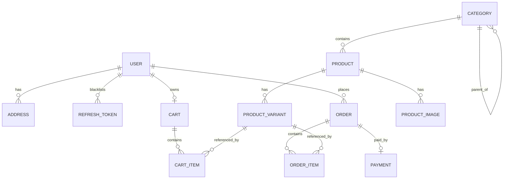

# Data Model — NORDVIK

> Consulted hats: **System Architect**, **Backend**, **Data Engineer**. Owner: Founder.
> This is the **Phase 1** transactional model (OLTP). The Phase 2 analytics model (warehouse) is intentionally out of scope here.

---

## Principles

- **Single writer per table.** Each table is owned by exactly one Django app (see the module table in [`ARCHITECTURE.md`](ARCHITECTURE.md#4-modules--bounded-contexts-c4-level-3)).
- **Money as integers.** All monetary amounts are stored as `BIGINT` in the currency's **smallest unit** (IDR has no cents, so this is whole rupiah). Floats are never used for money.
- **Soft state where useful.** Products/variants are archived (`is_active=False`) rather than deleted, so historical orders stay intact.
- **Snapshots at order time.** Orders copy the price, name, and shipping address that applied at purchase — later catalog edits must not mutate history.

---

## Entity-relationship diagram

---

## Tables

### `accounts`

- [x] **DATA-1.1 `user`** (custom user model, email as the identifier)
  - `id` PK · `email` (unique, indexed) · `password` (hashed) · `full_name` · `is_active` · `is_staff` · `date_joined`
- [x] **DATA-1.2 `address`**
  - `id` PK · `user_id` FK→user · `recipient` · `phone` · `line1` · `line2` · `city` · `province` · `postal_code` · `country` (default `ID`) · `is_default`
- [x] **DATA-1.3 `refresh_token`** (JWT refresh rotation + logout blacklist — see `ADR-0003`)
  - `id` PK · `user_id` FK→user · `jti` (unique) · `expires_at` · `revoked_at` (nullable) · `created_at`

### `catalog`

- [x] **DATA-2.1 `category`**
  - `id` PK · `parent_id` FK→category (nullable) · `name` · `slug` (unique) · `position` · `is_active`
- [x] **DATA-2.2 `product`**
  - `id` PK · `category_id` FK→category · `title` · `slug` (unique, indexed) · `description` · `brand` · `status` (`draft`/`active`/`archived`) · `base_price` (BIGINT, smallest unit) · `currency` (default `IDR`) · `created_at` · `updated_at`
- [x] **DATA-2.3 `product_variant`**
  - `id` PK · `product_id` FK→product · `sku` (unique) · `name` (e.g. "Oak / 120cm") · `attributes` (JSONB) · `price` (BIGINT; overrides base) · `stock_qty` (int) · `is_active`
  - *Stock lives here (single writer). Decremented under row lock at checkout.*
- [x] **DATA-2.4 `product_image`**
  - `id` PK · `product_id` FK→product · `url` · `alt` · `position`

### `cart`

- [x] **DATA-3.1 `cart`**
  - `id` PK · `user_id` FK→user (unique; one active cart per user) · `created_at` · `updated_at`
- [x] **DATA-3.2 `cart_item`**
  - `id` PK · `cart_id` FK→cart · `variant_id` FK→product_variant · `quantity` (int, ≥1) · `unit_price_snapshot` (BIGINT) · `created_at` · `updated_at`
  - *Unique constraint on `(cart_id, variant_id)`.*

### `orders`

- [x] **DATA-4.1 `order`**
  - `id` PK · `number` (human ref `NDV-YYYY-NNNNNN`, unique) · `user_id` FK→user · `status` (`pending_payment`/`paid`/`processing`/`shipped`/`completed`/`cancelled`) · `subtotal` · `shipping_cost` · `total` · `currency` · `shipping_method` · `shipping_method_name` · `shipping_address_snapshot` (JSONB) · `idempotency_key` (unique) · `created_at` · `updated_at`
- [x] **DATA-4.2 `order_item`**
  - `id` PK · `order_id` FK→order · `variant_id` FK→product_variant (nullable on delete) · `product_title_snapshot` · `variant_name_snapshot` · `unit_price` (BIGINT) · `quantity` · `line_total` (BIGINT)

### `payments`

- [x] **DATA-5.1 `payment`**
  - `id` PK · `order_id` FK→order (unique) · `provider` (`mock`/`stripe`/`midtrans`) · `status` (`initiated`/`succeeded`/`failed`/`refunded`) · `amount` (BIGINT) · `provider_reference` · `created_at`

---

## Constraints & indexes

- Unique: `user.email`, `category.slug`, `product.slug`, `product_variant.sku`, `order.number`, `order.idempotency_key`, `payment.order_id`.
- Composite unique: `cart_item (cart_id, variant_id)`.
- Indexes: `product(status, category_id)`, `order(user_id, created_at desc)`, plus Django's automatic index on every foreign key. The drawn-up `product_variant(product_id, is_active)` composite index is **not** created — see the reconciliation note below.
- Check constraints: `cart_item.quantity >= 1`; `stock_qty >= 0` (enforced by `PositiveIntegerField`); monetary columns `>= 0` on `order` and `order_item`. The catalog and cart money columns carry no such check — see the reconciliation note below.
- Foreign-key delete rules: catalog → `PROTECT` (do not orphan order history); `cart_item` → `CASCADE` from `cart`.

### Reconciliation notes — 2026-10-07

Bringing this document in line with the code (every table above is now built) surfaced two places
where the design intent above was never implemented:

1. **Money constraints are not enforced everywhere.** `product.base_price`, `product_variant.price`
   and `cart_item.unit_price_snapshot` are plain `BIGINT` with no database check, so a negative
   price can be saved — including from the admin console. The `>= 0` intent currently holds only
   for `order` and `order_item`.
2. **The `product_variant(product_id, is_active)` index was never created.**

Neither affects the correctness of the money flow as shipped. Both are tracked as [known
gaps](../04-delivery/ROADMAP.md#known-gaps) rather than being silently dropped. See
[`CHANGE-LOG.md`](../CHANGE-LOG.md), v0.1.4.

---

## Money & currency

- Every monetary column stores an integer in the smallest unit; `currency` accompanies any total that crosses a boundary.
- Formatting (`Rp 1.299.000`) happens in the presentation layer only.
- Phase 1 is single-currency (IDR). Multi-currency, if ever needed, becomes an ADR + migration — not a Phase 1 concern.

## PII & privacy

- PII: `user.email`, `user.full_name`, `address.*`, `order.shipping_address_snapshot`.
- Hashing: passwords via Django's default (Argon2/PBKDF2). Tokens are never stored in the database (stateless JWT), except refresh-token blacklist entries on logout.
- Backups/retention: Supabase free-tier automated backups; no PII shared with third parties except the (future) payment provider.

## Phase 2 hook (do not build now)

The transactional tables above will be the **source** for a CDC/ELT pipeline into a warehouse. That is why `order`/`order_item` rows are append-friendly and never hard-deleted. Full design is deferred to the Phase 2 data-engineering track.

## Quality checklist

- [x] Single writer per table.
- [x] Money is never a float.
- [x] Historical orders are immutable snapshots.
- [x] PII identified and handled.
- [x] Every table has a stated owner and delete rule.
