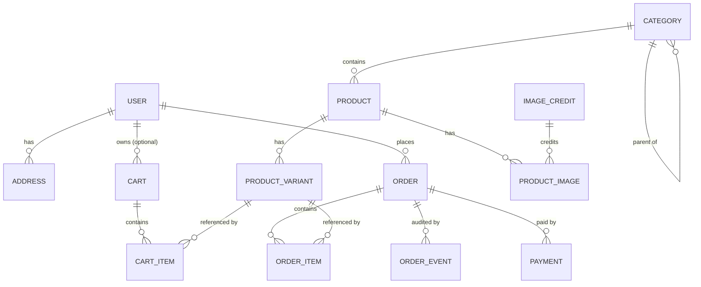

# Data Model — LYSHEIM

> Consulted hat: **Senior System Architect** with **Senior Backend**. Owner: Founder.
> Physical model for PostgreSQL as implemented by Django migrations. All money is stored as
> **integer minor units (cents)**; every table carries `created_at` / `updated_at`.

---

## 1. Entity-relationship diagram

## 2. Tables

### `accounts`

**`user`** — custom user model.

| Column | Type | Constraints |
|---|---|---|
| id | bigint PK | |
| email | citext/unique | unique, NOT NULL, indexed |
| password | varchar | hashed (Django), NOT NULL |
| display_name | varchar(120) | |
| is_active | boolean | default true |
| is_staff | boolean | default false (operator access) |
| created_at / updated_at | timestamptz | |

**`address`**

| Column | Type | Notes |
|---|---|---|
| id | bigint PK | |
| user_id | FK → user | on delete cascade |
| label | varchar(60) | e.g. "Home" |
| recipient, line1, line2 | varchar | |
| city, region | varchar | |
| postal_code | varchar(32) | |
| country | char(2) | ISO-3166 alpha-2 |
| phone | varchar(32) | |
| is_default | boolean | at most one per user (partial unique index) |

### `catalog`

**`category`** — `id`, `name`, `slug` (unique), `description`, `parent_id` (self-FK, nullable), `position`.

**`product`** — `id`, `category_id` FK, `name`, `slug` (unique), `description`, `material`, `color`, `width_cm/height_cm/depth_cm` (nullable numerics), `base_price_cents`, `currency` (`USD`), `is_active`, `attributes` (JSONB, for extra specs).

**`product_variant`** — the concrete SKU: `id`, `product_id` FK, `sku` (unique), `name` (e.g. "Oak / 120cm"), `price_cents`, `stock_qty` (int ≥ 0), `is_active`. A product with no explicit variants gets a single default variant at seed time.

**`product_image`** — `id`, `product_id` FK, `path`, `alt`, `position`, `credit_id` FK (nullable → `image_credit`).

**`image_credit`** — `id`, `title`, `creator`, `license`, `source`, `source_page_url`. Populated from the reference `manifest.csv` (see `ADR-0012`); rendered on `/pages/credits` (`SCOPE.md` `US-6.1`).

### `cart`

**`cart`** — `id`, `user_id` (nullable FK), `session_key` (nullable, for guests), `status` (`active|converted|abandoned`), timestamps. Exactly one of `user_id` / `session_key` is set.

**`cart_item`** — `id`, `cart_id` FK, `variant_id` FK, `quantity` (int ≥ 1). Unique on (`cart_id`, `variant_id`). Price is resolved live from the variant until checkout.

### `orders`

**`order`** — `id`, `number` (unique, human-facing), `user_id` FK, `status`, `email`, money fields (`subtotal_cents`, `shipping_cents`, `total_cents`), `currency`, a **shipping-address snapshot** (recipient/line1/line2/city/region/postal_code/country), `idempotency_key` (unique, nullable), timestamps.

**`order_item`** — `id`, `order_id` FK, `variant_id` (nullable FK), **snapshots**: `product_name`, `variant_name`, `unit_price_cents`, `quantity`, `line_total_cents`.

**`order_event`** — `id`, `order_id` FK, `from_status`, `to_status`, `note`, `actor`, `created_at`. Append-only audit trail of status transitions (`SCOPE.md` `US-5.5`).

**`payment`** — `id`, `order_id` FK, `provider` (`mock`), `status`, `amount_cents`, `currency`, `provider_ref`, timestamps.

## 3. Enumerations

- **OrderStatus:** `pending` → `paid` → `shipped` → `delivered`; any → `cancelled` (guarded transitions, see `ARCHITECTURE.md` and `US-5.5`).
- **PaymentStatus:** `initiated` → `succeeded` | `failed`.
- **CartStatus:** `active` | `converted` | `abandoned`.

## 4. Indexes & constraints

- Unique: `user.email`, `category.slug`, `product.slug`, `product_variant.sku`, `order.number`, `order.idempotency_key`.
- Partial unique: one default `address` per user.
- Foreign keys: `product.category_id`, `product_variant.product_id`, `cart_item.cart_id`,
  `order.user_id`, `order_item.order_id`.
- Query indexes: `product.is_active`, `product.category_id`, `order.user_id`, `order.status`.
- Check constraints: `stock_qty >= 0`, `quantity >= 1`, money columns `>= 0`.

## 5. Money & currency

Amounts are **integer cents** in **USD** (single currency in v1). Formatting is a
presentation concern (`UX.md` §9). Multi-currency is explicitly out of scope (`SCOPE.md` §5).

## 6. Migrations strategy

- Django migrations, one logical change per migration, generated and reviewed by hand.
- No migration squashing until the schema is stable (post-M5).
- Destructive changes require a plan step (backfill → switch → drop), never a single drop.

## 7. Seeding strategy

- `python manage.py seed` — idempotent; `--reset` clears domain data first.
- Content: categories, products, variants, and stock generated from a **deterministic**
  Faker seed so runs are reproducible.
- Images imported from the reference `some_source/` set; `image_credit` rows populated from
  `manifest.csv` so the attribution page is always complete.
- The seed is safe to re-run in the deployed demo.

## 8. Phase 2 (draft, not v1)

A future `storefront_event` append-only table (`id`, `occurred_at`, `session_id`,
`user_id` nullable, `event_type`, `payload` JSONB) and an `analytics` schema of star-shaped
dimension/fact tables. Deliberately out of scope for v1 (`SCOPE.md` `EPIC-7`).
