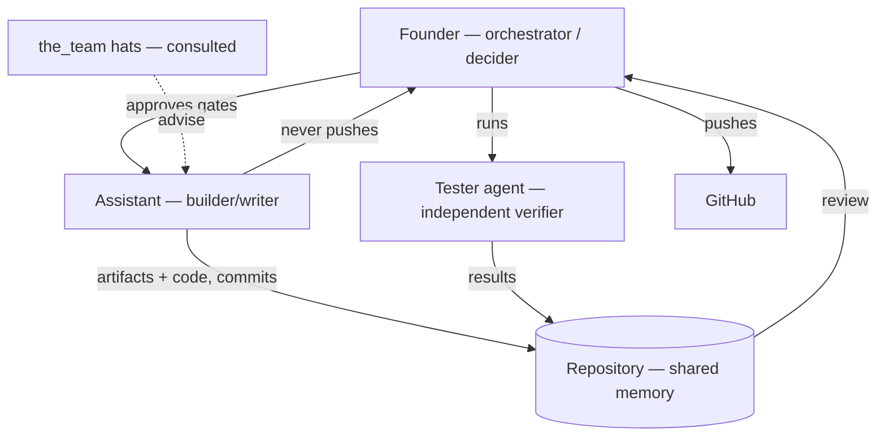

# Agent Topology & Collaboration Protocol — LYSHEIM

> Consulted hat: **Senior Multi-Agent Orchestrator**. Owner: Founder.
> LYSHEIM is "built by a system of agents": the **founder** (human orchestrator), the
> **assistant** (builder), a separate **tester agent**, and the `the_team/` specialist hats.
> This document defines who does what, how artifacts are handed off, where state lives, and
> how the workflow recovers from failure.

---

## 1. Topology

A **hierarchical, human-in-the-loop** topology: the founder orchestrates; specialist hats are
consulted in sequence at stage gates; the assistant is the single writer of artifacts; the
tester agent is an independent verifier.

**Why this shape.** One writer prevents merge conflicts of intent; independent verification
prevents the builder from grading its own work; the human gate prevents autonomous
irreversible actions.

## 2. Roles & responsibilities

| Agent | Type | Responsibility | Must not |
|---|---|---|---|
| Founder | human | Scope, prioritise, approve each stage gate, **push** to GitHub, run the tester agent | Delegate the finish-line decision |
| Assistant | AI (builder) | Produce docs and code, pass gates, write tests, commit locally | `git push`; edit tester results; invent scope |
| Tester agent | AI (verifier) | Execute QA scenarios in another session, record results | Edit scenarios or application code |
| `the_team` hats | AI (consulted) | Provide specialist analysis at their stage | Make final calls (advisory only) |

## 3. Task decomposition & handoff contracts

Work is decomposed by **stage** (business → product → architecture → delivery → cross-cutting)
and then by **milestone/increment** (`ROADMAP.md`). Each handoff is a **file with a stable ID
scheme**, so state is never trapped in a chat:

| Handoff | From → To | Contract |
|---|---|---|
| Strategy | strategist → founder | `01-business/STRATEGY.md` + `_working/TODO_*` |
| Scope & UX | product hats → founder | `02-product/*.md` |
| Architecture | architect + eng hats → founder | `03-architecture/*.md` + ADRs |
| Roadmap | lead + PM → founder | `04-delivery/*.md` |
| Code increment | assistant → founder | one commit; gates green; run instructions |
| QA scenario | assistant → tester | `05-qa/scenarios/<feature>.md` |
| QA result | tester → founder | `05-qa/results/<feature>.md` (immutable) |

**Handoff rule:** an artifact is only "handed off" when it is committed and linked from
`PLAN.md`. Chat alone is never a contract.

## 4. Communication protocol

- **Artifact-based**, not message-based: agents communicate by writing and reading repository
  files. IDs (`GOAL-/EPIC-/US-/NFR-/SYS-/RISK-/ADR-/SEC-FIND-`) are the shared vocabulary.
- **One writer per artifact.** The assistant owns docs and code; the tester owns results. No
  two agents write the same file.
- **Provenance rule:** scenarios are the assistant's and mutable; tester results are immutable
  to the assistant (a stale result may be deleted, never edited).

## 5. Memory & state management

| Memory | Where | Mutability |
|---|---|---|
| Current truth | `PLAN.md` | living |
| History of decisions | `CHANGE-LOG.md`, `decisions/` | append-only |
| Working notes | `_working/TODO_*.md` | mutable |
| Code & tests | `backend/`, `frontend/` | mutable, gated |
| Verification | `05-qa/results/` | immutable to the builder |

There is **no hidden state**: if it matters, it is in the repo. This also satisfies continuity
(`RISK-9`).

## 6. Failure recovery & supervision

- **Gate failure** (lint/type/test): the assistant fixes and re-runs before committing; the
  founder is not asked to run gates manually.
- **Ambiguity / missing decision:** the assistant stops and asks the founder rather than
  guessing, and records the question against the relevant stage.
- **Blocked increment:** escalated to the founder as a plain-language blocker with options.
- **Long-running job:** monitored with a bounded wait; on completion, failure, or timeout the
  session resumes and reports.
- **Autonomy limit:** the assistant never performs irreversible or shared-state actions
  (push, deploy, delete, publish) — those are the founder's, by design.

## 7. Evaluation & observability

- **Per increment:** the Definition of Done (`WORKING-AGREEMENT.md` §5) — small, gated,
  tested, documented.
- **Per milestone:** exit criteria (`ROADMAP.md` §2).
- **Trace:** the git history plus `CHANGE-LOG.md` is the audit log of what was decided and
  when; QA results are the independent evidence.
- **Cost/effort:** tracked implicitly through increment size; no separate metering (the
  project is scoped to a solo budget).

## 8. Anti-patterns to avoid

- Chat-only decisions (lost state) — record them in the repo.
- The builder approving its own work — keep the tester independent.
- Silent scope growth — every change is an ADR + change-log entry.
- Autonomous irreversible actions — keep the human gate.

## 9. Quality checklist

- [x] Topology and roles defined, with explicit prohibitions.
- [x] Handoff contracts named, with artifact formats.
- [x] Communication protocol and ID scheme defined.
- [x] Memory/state locations defined, with mutability rules.
- [x] Failure recovery and escalation defined.
- [x] Evaluation signals defined per increment and per milestone.
- [x] Human-in-the-loop gate for irreversible actions.
