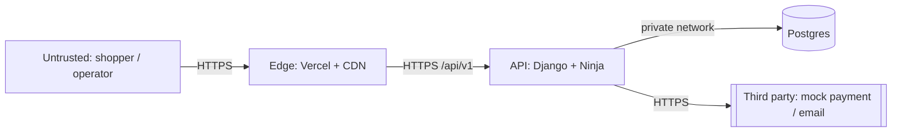

# Security Baseline — LYSHEIM

> Consulted hat: **Senior Cybersecurity**. Owner: Founder.
> Status: **design-stage baseline**. Findings here are design-level risks and required
> controls, reviewed against the architecture in
> [`../03-architecture/ARCHITECTURE.md`](../03-architecture/ARCHITECTURE.md). No exploit code
> or attack tooling is included, by policy. The *evidence* review (scans, results) is produced
> at M6.

---

## 1. Scope & context

- **System:** LYSHEIM — Next.js storefront, Django 6 API, PostgreSQL, Django admin operator
  console, a mock payment provider, and a mocked email transport.
- **Scope:** application security (authn/authz, input handling, session/token, API), identity
  and access, secrets, transport, logging, and privacy handling.
- **Out of scope:** real payment processing (PCI-DSS), MFA, WAF, pen-testing, and the
  attacker's perspective (by policy no exploit development is performed).

### Data classification

| Class | Examples | Handling |
|---|---|---|
| Public | catalog, prices, published pages | no restriction |
| Internal | order counts, operator notes | authenticated access only |
| Confidential (PII) | email, display name, shipping address | protected in transit + at rest; not logged |
| Secret | password hashes, JWT signing key, DB credentials, refresh tokens | never in code or logs; env/vault only |
| Regulated | none in v1 (payments are mock) | n/a |

### Compliance posture

- **PCI-DSS:** not applicable — payments are mocked (`ADR-0010`).
- **GDPR-relevant:** yes, in principle — email and address are personal data of EU users.
  We apply **data minimisation**, a **retention** rule (guest carts expire), and an
  **erasure** path (deleting an account removes its PII). A formal DPIA is out of scope.

## 2. Assets & trust boundaries



- **Assets:** credentials and tokens, PII, order integrity, catalog integrity, admin access.
- **Boundaries:** browser→edge, edge→API, API→DB, API→third party, operator→admin.
- **Principle:** every boundary crossing treats the input as untrusted and validates it
  server-side; **authorization is never trusted from the client**.

## 3. Threat model (STRIDE, by component)

| Component | Spoofing | Tampering | Repudiation | Info disclosure | DoS | Elevation |
|---|---|---|---|---|---|---|
| Auth endpoints | credential stuffing | token forgery | weak audit | token leak | brute force | — |
| Storefront API | session hijack | request tampering | — | IDOR | scraping | — |
| Cart (cookie) | forged cookie | quantity tamper | — | — | — | — |
| Orders | — | price tamper | status disputes | order IDOR | mass create | — |
| Admin console | credential theft | data tamper | weak audit | full data | — | privilege abuse |
| DB / infra | — | — | — | dump | — | — |

## 4. Findings & required controls

- [ ] **SEC-FIND-1.1 [AuthN — token exposure]** Long-lived tokens in JS-readable storage
  would be XSS-exfiltratable. **Risk:** High likelihood × High impact if regression occurs.
  **Component:** web session. **Control:** access token in memory only; refresh token in an
  httpOnly, Secure cookie (`ADR-0009`).
- [ ] **SEC-FIND-1.2 [AuthZ — IDOR]** Order, address, and cart resources identified by id are
  a broken-access-control risk. **Risk:** Medium × High. **Component:** API. **Control:**
  enforce object ownership server-side on every read/write; add explicit tests.
- [ ] **SEC-FIND-1.3 [Injection]** Any raw SQL or string-built queries. **Risk:** Medium ×
  High. **Component:** backend. **Control:** Django ORM only, parameterised queries, input
  validated by Ninja schemas; no string concatenation into SQL.
- [ ] **SEC-FIND-1.4 [XSS]** Unescaped rendering of user/catalog content. **Risk:** Medium ×
  High. **Component:** frontend. **Control:** React escaping by default; no
  `dangerouslySetInnerHTML`; ship a **Content Security Policy** (Django 6 built-in).
- [ ] **SEC-FIND-1.5 [Secrets]** Credentials in code, logs, or git. **Risk:** Low likelihood ×
  Critical impact. **Component:** all. **Control:** env-only config; `.env` git-ignored;
  `.env.example` documents keys; a settings guard fails fast if a required secret is missing;
  never log tokens/PII.
- [ ] **SEC-FIND-1.6 [DoS / abuse]** Unthrottled auth and order creation. **Risk:** Medium ×
  Medium. **Component:** API. **Control:** throttling on auth, add-to-cart, and order
  endpoints; bounded `page_size`; request body size limits.
- [ ] **SEC-FIND-1.7 [Admin exposure]** The operator console is the highest-value target.
  **Risk:** Medium × High. **Component:** admin. **Control:** strong unique password,
  `is_staff` gate, throttled login, and **not** linked publicly. (MFA is out of scope for v1
  and is recorded as an accepted residual risk.)
- [ ] **SEC-FIND-1.8 [Supply chain]** Vulnerable or unpinned dependencies. **Risk:** Medium ×
  High. **Component:** CI. **Control:** lockfiles committed; `pip-audit` and `pnpm audit` in
  CI; Dependabot-style update cadence.
- [ ] **SEC-FIND-1.9 [Logging hygiene]** Secrets or PII written to logs. **Risk:** Medium ×
  Medium. **Component:** backend. **Control:** structured logs with an allow-list of fields;
  redact credentials and PII; request ids for correlation.
- [ ] **SEC-FIND-1.10 [Transport & headers]** Missing HSTS/Secure cookies/CORS restrictions.
  **Risk:** Medium × Medium. **Component:** edge + API. **Control:** HTTPS only, HSTS,
  `Secure`/`HttpOnly`/`SameSite` cookies, and an explicit CORS allow-list (Vercel origin).
- [ ] **SEC-FIND-1.11 [CSRF on cookie auth]** The refresh cookie reintroduces CSRF risk.
  **Risk:** Medium × Medium. **Component:** auth. **Control:** origin check on the refresh
  endpoint plus `SameSite`; refresh scoped to its path (`ADR-0009`).
- [ ] **SEC-FIND-1.12 [Cart cookie tampering]** Forged guest cart identifiers. **Risk:** Low ×
  Low. **Component:** cart. **Control:** **signed** cookie; server rebuilds totals from the
  database, never from the cookie.

## 5. Remediation plan

| ID | Finding | Priority | Owner | Validation |
|---|---|---|---|---|
| `SEC-REMEDIATE-1.1` | `SEC-FIND-1.1` | High | Founder/backend | token-storage test; no token in `localStorage` |
| `SEC-REMEDIATE-1.2` | `SEC-FIND-1.2` | High | backend | IDOR tests: cross-user access returns 404/403 |
| `SEC-REMEDIATE-1.3` | `SEC-FIND-1.3` | High | backend | no raw SQL; review of query call sites |
| `SEC-REMEDIATE-1.4` | `SEC-FIND-1.4` | High | frontend | CSP header present; axe/XSS review clean |
| `SEC-REMEDIATE-1.5` | `SEC-FIND-1.5` | Critical | both | secret-guard test; secret scan in CI |
| `SEC-REMEDIATE-1.6` | `SEC-FIND-1.6` | Medium | backend | throttling tests return 429 |
| `SEC-REMEDIATE-1.7` | `SEC-FIND-1.7` | High | ops | admin login throttled; account documented |
| `SEC-REMEDIATE-1.8` | `SEC-FIND-1.8` | Medium | CI | audit commands exit clean |
| `SEC-REMEDIATE-1.9` | `SEC-FIND-1.9` | Medium | backend | log review contains no PII/secrets |
| `SEC-REMEDIATE-1.10` | `SEC-FIND-1.10` | Medium | ops | header check on the deployed URL |
| `SEC-REMEDIATE-1.11` | `SEC-FIND-1.11` | Medium | backend | cross-origin refresh rejected without origin |
| `SEC-REMEDIATE-1.12` | `SEC-FIND-1.12` | Low | backend | tampered cookie rejected (signature check) |

## 6. Secure configuration baseline

```
# Response headers (default-deny posture)
Strict-Transport-Security: max-age=31536000; includeSubDomains
X-Content-Type-Options: nosniff
Referrer-Policy: strict-origin-when-cross-origin
Content-Security-Policy: default-src 'self'; img-src 'self' data:; object-src 'none'
# Cookies
refresh:  HttpOnly; Secure; SameSite=None; Path=/api/v1/auth
# CORS: allow-list only the Vercel origin, with credentials
```

## 7. Detection, logging & incident response

- **Log:** auth success/failure, throttling (429), admin logins, order status changes,
  authorization denials. **Do not log** tokens, passwords, or full addresses.
- **Alert (free-tier, pragmatic):** spike in 401/429, repeated admin login failures, 5xx rate.
- **Playbook (light):** credential compromise → rotate signing key + revoke refresh tokens +
  force reset; data exposure → assess scope, rotate secrets, notify. Owner: Founder.

## 8. Privacy & data protection

- Collect the minimum (email, name, address). **Do not** store payment data (mock).
- **Retention:** guest carts expire (default 30 days); logs retained short and PII-free.
- **Erasure:** deleting an account removes its PII; orders are anonymised rather than deleted
  (for integrity) where feasible.

## 9. Verification commands

```
# Backend dependency audit
uv run pip-audit
# Django deployment checks
uv run python manage.py check --deploy
# Frontend dependency audit
pnpm audit --prod
# Deployed header check (after M7)
curl -sI https://<api-host>/healthz
```

## 10. Quality checklist

- [x] Threat model covers all major components and trust boundaries.
- [x] Findings prioritised by realistic risk, not raw severity.
- [x] Authn/authz controls specified for every boundary.
- [x] Secrets/PII protection specified for rest, transit, and logs.
- [x] Detection and a light incident playbook defined.
- [x] Compliance posture stated (PCI n/a; GDPR-relevant handling).
- [x] No exploit code or attack instructions included.
